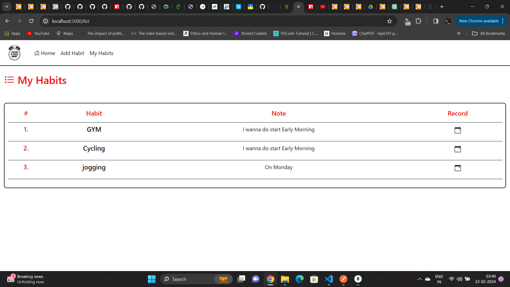

# Habit Tracker Web Application

This is a full-stack Habit Tracker web application built with Node.js, Express.js, and EJS. It allows users to define their habits and track their progress over time.

## Description

The Habit Tracker app enables users to create and manage their habits effectively. Users can define various habits they want to track, such as reading a book, going for a run, drinking water, etc. Once defined, users can mark each habit as done, not done, or not yet tracked for each day. The app provides a visual representation of habit progress, making it easy for users to stay motivated and consistent with their habits.

## Features

- Habit management: Users can define their habits, edit existing habits, and delete habits they no longer want to track.
- Daily habit tracking: Users can mark each habit as done, not done, or not yet tracked for each day.
- Habit progress visualization: The app provides visual representations of habit progress, such as graphs or charts, to help users track their consistency and improvement over time.

## Technologies Used

- Node.js
- Express.js
- EJS (Embedded JavaScript) for templating
- MongoDB for database storage

## Installation

1. Clone the repository:

   ```bash
   git clone https://github.com/your-username/habit-tracker.git
   Navigate to the project directory:
2. Install dependencies:

    ```bash
    cd habit-tracker
    npm install
    ```

3. Set up environment variables:

    Create a `.env` file in the root directory and add the following variables:

    ```plaintext
    PORT=5000
    MONGODB_URI=your_mongodb_uri
    

4. Start the server:

    ```bash
    npm start
    ```

## API Documentation

### Habit Routes

#### Get Home Page
- **URL:** `/`
- **Method:** `GET`
- **Description:** Render the home page.
- **Response:** Rendered HTML page displaying the home page.

#### Get List of Habits
- **URL:** `/list`
- **Method:** `GET`
- **Description:** Retrieve a list of all habits.
- **Response:** Rendered HTML page displaying the list of habits.

#### Get Habit Record Page
- **URL:** `/record/:id`
- **Method:** `GET`
- **Description:** Retrieve the record page for a specific habit.
- **Request Parameters:** `id` (ID of the habit)
- **Response:** Rendered HTML page displaying the record page for the specified habit.

#### Get Add Habit Page
- **URL:** `/add-habit`
- **Method:** `GET`
- **Description:** Retrieve the page for adding a new habit.
- **Response:** Rendered HTML page displaying the form to add a new habit.

#### Change Habit Status
- **URL:** `/change-status/:id`
- **Method:** `GET`
- **Description:** Change the status of a habit (e.g., mark as done, not done).
- **Request Parameters:** `id` (ID of the habit)
- **Response:** Redirect to the home page after updating the habit status.

#### Add New Habit
- **URL:** `/add-habit`
- **Method:** `POST`
- **Description:** Add a new habit.
- **Request Body:** JSON object containing habit details (name, description)
- **Response:** Redirect to the home page after adding the new habit.

## Contributing

Contributions are welcome! Please create a new branch for your changes and submit a pull request for review.


##Screenshots





